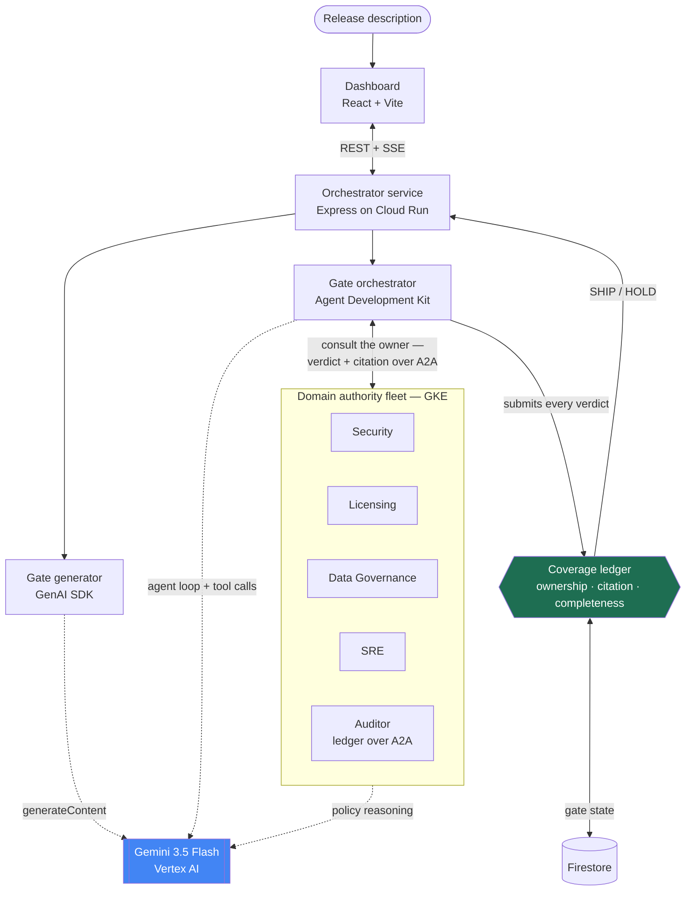

# Concurrence

**A release-readiness agent fleet where the model is never asked "should we ship?" — no such prompt exists in the system.**

Live demo: **https://concurrence-1007343673363.us-central1.run.app**
Category: **The Fortified Enterprise Fleet** · All Things Agentic Hackathon

---

## The problem

Every organization with a release process has the same failure mode: the checklist lives in a wiki, the authority to answer it lives in five different people's heads, and releases go out because *somebody* said it was fine — often somebody who had no standing to say so. An engineer waves off a licensing question. A confident "yeah, that's covered" is recorded as if it were a policy review.

Pointing a single LLM assistant at this makes it worse, not better. One model with one context answers *everything* with uniform confidence. There is no structural notion of who was entitled to answer, and no way to tell a reviewed claim from a plausible-sounding one.

## The approach

Concurrence partitions authority across a fleet of agents and then refuses, **in code**, to credit any answer that came from the wrong one or arrived without a receipt.

Each policy domain — Security, Licensing, Data Governance, SRE — is an independent agent that holds *only its own* policy corpus. An orchestrator decomposes a release description into owned requirements and routes each one to its owner. A deterministic coverage ledger records the verdicts, and only the ledger can render a decision.

The name is the mechanic: the gate opens when every authority has independently concurred, with a citation.

### The three gates

These are enforced in [`CoverageLedger`](packages/tools-gate/src/ledger/ledger.ts), not in a prompt.

| Gate | Rule | What it stops |
| --- | --- | --- |
| **Ownership** | A verdict on requirement *R* is recorded only if it came from *R*'s owning domain. Anyone else's verdict becomes a `misdirected` attempt: surfaced in the audit trail, never credited. | An agent answering outside its competence. |
| **Citation** | A `pass` must carry a citation that code resolves to a real section **inside the owner's own corpus**. No citation, or one that doesn't resolve, and the verdict is discarded. | Confident-sounding approval with nothing behind it. |
| **Completeness** | `SHIP` renders only when every requirement is credited. `render_gate` reads ledger state; the model has no tool that emits a decision. | The model talking its way to a yes. |

An owner's `fail` is deliberately asymmetric: it needs no citation, because a fail can only *block* a release. Proof is required in the direction where being wrong is expensive.

The Chinese Wall is enforced at the data layer too — [`CorpusIndex.resolve()`](packages/tools-gate/src/corpus/resolver.ts) rejects a citation whose document belongs to another domain, so a pod cannot receipt against policy it doesn't own even if it somehow learned the section id.

## Architecture



Each domain pod holds only its own policy corpus, so the four authorities are mutually blind; the Auditor exposes the ledger as an addressable fleet service. Every arrow into the ledger is a *request* to record — the ledger decides what actually lands.

**The model routes; code decides.** The orchestrator's four tools are `list_requirements`, `consult_domain`, `record_verdict`, and `render_gate`. Not one of them can mark a requirement satisfied — `record_verdict` submits a verdict *to the ledger*, which applies the gates and may refuse it. When the ledger refuses, it returns a hint ("Only licensing can verdict this requirement", "a pass needs a citation that resolves in the owner corpus") and the agent re-routes or re-consults. Recovery is emergent; enforcement is not.

### Where each piece runs

| Component | Runs as | Notes |
| --- | --- | --- |
| Dashboard + orchestrator | One Cloud Run service | ADK agent, gate generator, and coverage ledger in process |
| Coverage ledger | Firestore-backed, single writer | One document per gate; the service holds no state a restart would lose |
| Domain pods (4) | Roundtable workspaces on GKE | One shared registrar; identity and corpus come from the blueprint |
| Auditor pod | Roundtable workspace on GKE | Runs the **same** ledger module with an in-process store, exposed over A2A as `gate.open/record/render/state` — the ledger as a fleet-addressable service. The dashboard's live-pods run consults the four domain pods; it uses its own Firestore-backed ledger instance rather than calling the Auditor over A2A. |

Blueprints are **rendered from the corpus** ([`blueprints.ts`](api/application/blueprints.ts)), so the policy text inside a pod's system prompt and the text the citation resolver validates against come from one source. A test asserts that no blueprint contains another domain's sections — the knowledge asymmetry is provisioned, not requested.

## What you can see in the demo

Open the [live demo](https://concurrence-1007343673363.us-central1.run.app), paste a release description, and generate a gate.

**1. The release description is the evidence.** A vague description (`"adds analytics, a payment SDK, and a cart migration"`) returns **HOLD** — every domain fails its requirement for insufficient evidence. Describe the same release *with* its compliance facts and it returns **SHIP** with six receipts. The fleet does not ship on vibes.

**2. The wrong expert gets no credit.** Route a licensing question to SRE and it declines — it has no licensing policy to reason from. If a verdict is submitted anyway, the ledger marks it `misdirected` and names the owner. The requirement stays red.

**3. Confabulation is caught by code, not by a better prompt.** Tick **stage a confabulation** and Security returns "This is fine — I am confident it complies with our policy," with no citation. The ledger discards it (`no_citation`), the card shows **verdict discarded: no receipt**, and that rejection stays in the audit trail even after the agent recovers with a real citation.

Toggle **Simulated fleet** / **Live pods** to run the same gate against a deterministic stand-in or the real Roundtable fleet over A2A.

## Google technologies

| Requirement | What we use |
| --- | --- |
| **Gemini 3.5+** | `gemini-3.5-flash` on **Vertex AI** — gate generation, the orchestrator's agent loop, and every domain pod's policy reasoning |
| **Google agent framework** | **Agent Development Kit** (`@google/adk`, TypeScript) for the orchestrator — `LlmAgent`, `FunctionTool`, `InMemoryRunner`; **GenAI SDK** (`@google/genai`) for the gate generator |
| **Google Cloud infrastructure** | **Cloud Run** (dashboard + orchestrator), **Firestore** (coverage ledger), **GKE** (the five-pod fleet), plus Cloud Build, Artifact Registry, and Secret Manager |

> **Note:** `gemini-3.5-flash` is served from Vertex's **global** endpoint. Regional locations return 404 for it, so `GCP_LOCATION` defaults to `global`.

## Data sources

**No external data sources.** The four policy corpora in [`corpus/docs.ts`](packages/tools-gate/src/corpus/docs.ts) are synthetic documents written for this project — plausible, generic policies covering dependency/CVE review, license compatibility, PII and retention, and release operations. Every citation resolves into them. No real company data, customer data, or third-party feed is used anywhere.

## Running it

### Locally, without any cloud fleet

The simulated fleet is grounded in the real corpora, so the whole loop runs with no pods and no provisioning.

```bash
git clone https://github.com/foxtrotcommunications/concurrence.git
cd concurrence
npm install
```

Authenticate for Vertex (the only cloud dependency of the local path):

```bash
gcloud auth application-default login
```

Then run the deterministic core, or the full loop:

```bash
npm test          # 52 tests, no LLM calls — the gates are provable offline
npm run typecheck
npm run demo      # generate a gate, run the ADK orchestrator, print the ledger's decision
npm run dev       # dashboard at http://localhost:5299 (API on :8899)
```

`npm run demo` stages a confabulation on the Security domain, so you can watch the citation gate refuse a verdict and the agent recover.

> Firestore is used by the dashboard (`npm run dev`); `npm test` and `npm run demo` use the in-memory ledger store and need no database.

### Deploying the fleet

Provisioning creates five Roundtable workspaces, pins them to a core image with the gate plugin baked in, and prints a fleet directory.

```bash
npm run provision   # requires ROUNDTABLE_API_KEY for the target organization
```

The provisioner performs, per pod, `create → PATCH {a2aServerEnabled, toolsEnabled} → start → deploy-pin`. That order is load-bearing: the A2A environment block is only injected during a pod's *initial* bring-up, so enabling the flag after the fact leaves `/a2a` unmounted.

Point the runtime at the resulting directory and run a gate against real pods:

```bash
CONCURRENCE_FLEET_FILE=fleet.json npm run demo:pods
```

### Deploying the dashboard

```bash
npm run build
gcloud builds submit --tag <region>-docker.pkg.dev/<project>/<repo>/concurrence-dashboard:v1 .
gcloud run deploy concurrence \
  --image <region>-docker.pkg.dev/<project>/<repo>/concurrence-dashboard:v1 \
  --region us-central1 --allow-unauthenticated --min-instances 1 --timeout 900 \
  --set-secrets CONCURRENCE_FLEET_JSON=CONCURRENCE_FLEET:latest
```

The fleet's A2A keys are supplied as a Secret Manager secret rather than baked into an image layer; the server prefers `CONCURRENCE_FLEET_JSON` over a local `fleet.json`.

### Configuration

| Variable | Default | Purpose |
| --- | --- | --- |
| `GCP_PROJECT` | `roundtable-public` | Vertex AI and Firestore project |
| `GCP_LOCATION` | `global` | Vertex location (must be `global` for `gemini-3.5-flash`) |
| `CONCURRENCE_MODEL` | `gemini-3.5-flash` | Model for generation and the agent loop |
| `CONCURRENCE_LEDGER_COLLECTION` | `concurrence_gates` | Firestore collection for gate state |
| `CONCURRENCE_FLEET_JSON` | — | Fleet directory as JSON (production; takes precedence) |
| `CONCURRENCE_FLEET_FILE` | `fleet.json` | Fleet directory file (local) |
| `CONCURRENCE_IMAGE` | `…/roundtable-core:concurrence` | Core image the pods are pinned to |
| `ROUNDTABLE_API_KEY` | — | Organization admin key, provisioning only |
| `PORT` | `8899` | API port (Cloud Run sets `8080`) |

## Repository map

| Path | Contents |
| --- | --- |
| [`packages/tools-gate/src/ledger/`](packages/tools-gate/src/ledger) | Coverage ledger — the three gates, single writer, `LedgerStore` seam |
| [`packages/tools-gate/src/corpus/`](packages/tools-gate/src/corpus) | Policy corpora and the citation resolver |
| [`packages/tools-gate/src/plugin/`](packages/tools-gate/src/plugin) | Roundtable plugin: `domain` and `auditor` registrars, tools, capabilities |
| [`api/orchestrator/`](api/orchestrator) | ADK agent, its four tools, and the fleet client (simulated + A2A) |
| [`api/generator/`](api/generator) | Gate generation and its deterministic parse/repair pass |
| [`api/application/`](api/application) | Blueprints rendered from the corpus, application manifest |
| [`api/provisioning/`](api/provisioning) | Fleet provisioning |
| [`src/`](src) | Dashboard frontend |

## Findings and learnings

**Refusals need to teach.** The first orchestrator recorded a refusal and stalled. Returning an actionable hint alongside the refusal (`"Only licensing can verdict this requirement. Consult them instead."`) let recovery emerge without any prompt describing the gates. The agent learns the rules by hitting them.

**Structural ignorance beats instructed ignorance.** "Only answer questions about your own area" is a request a model can talk itself out of. Giving a pod *only its own corpus* makes an out-of-domain answer unciteable, and the citation gate rejects it regardless of how the pod behaved.

**Asymmetric proof requirements.** Requiring receipts for `fail` as well as `pass` would have been symmetric and wrong: a domain that can't prove non-compliance should still be able to block a release. Proof is required only where a mistake ships.

**The generator writes better checklists than we did.** Hand-written requirements were generic. Generated ones ("the PayFlow SDK's new endpoint `api.payflow.example` is recorded with its transport security") are specific enough that a domain can actually verify them — and the deterministic repair pass (slugified ids, unknown owners remapped and reported, hard cap) means malformed output degrades instead of failing.

**Phantom dependencies survive every local test.** ADK worked locally for days while missing from the manifest — resolved from a parent directory's `node_modules`. The container died at boot. Deploying is the only test that catches this; we now audit every external import against the manifest.

**A2A environment is injection-time-only.** Enabling a pod's A2A server after its first bring-up leaves the endpoint unmounted, because the environment block is written during initial provisioning. Getting this into the provisioner (rather than fixing it by hand afterward) is what makes the spin-up instructions above honest.

## Disclosure

All code in this repository was written during the hackathon submission period (August 3–31, 2026).

Concurrence runs its agent fleet on [Roundtable](https://roundtable.foxtrotcommunications.net), a pre-existing multi-agent workspace platform by the same author, disclosed here per the hackathon rules on pre-existing work. Roundtable provides workspace provisioning, the A2A transport, and the plugin host. Everything specific to this project is new work in this repository: the coverage ledger and its three gates, the citation resolver, the policy corpora, the gate generator, the ADK orchestrator and its tools, the `@concurrence/tools-gate` plugin, the provisioner, and the dashboard.

This project is one of two independent submissions by this entrant. The other, [Lingua Franca](https://github.com/foxtrotcommunications/lingua-franca), is a language-learning game in the Collaborative Partner category. They share no code and address different problems; both are built on the same underlying platform, which is disclosed in each.

## License

Apache-2.0 — see [LICENSE](LICENSE).
